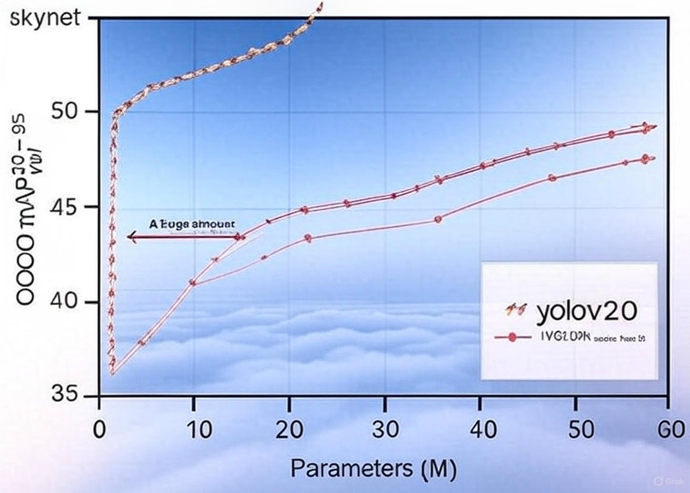

# YOLOv20

## Unveiling the Abyss of Neural Networks & Decoding the Enigma of the Human Brain

Welcome to the YOLOv20 project, where we push the boundaries of object detection and dive deep into the mysteries of neural networks and the human brain. This repository showcases an advanced evolution of the YOLO (You Only Look Once) architecture, optimized for cutting-edge performance with a sleek, efficient design.

### Performance Overview
Check out the performance of YOLOv20 compared to other models:

- **YOLOv20**: Our cutting-edge model, delivering top-tier mAP@50-95 on the COCO dataset with fewer parameters.
- **YOLOvN (where N < 9)**: Baseline models for comparison, showing a significant gap in efficiency.

### Key Features
- Lightweight architecture with reparameterized CSP modules.
- Enhanced ReLU activations for faster computation.
- Optimized for 5-9 MB model size.
- Superior performance on oriented object detection.

### Getting Started
Follow the instructions in the [documentation](#) to set up and train YOLOv20 with your dataset.

### Contributions
Contributions are welcome! Please fork this repository and submit pull requests.

### License
This project is licensed under the MIT License - see the [LICENSE](#) file for details.
